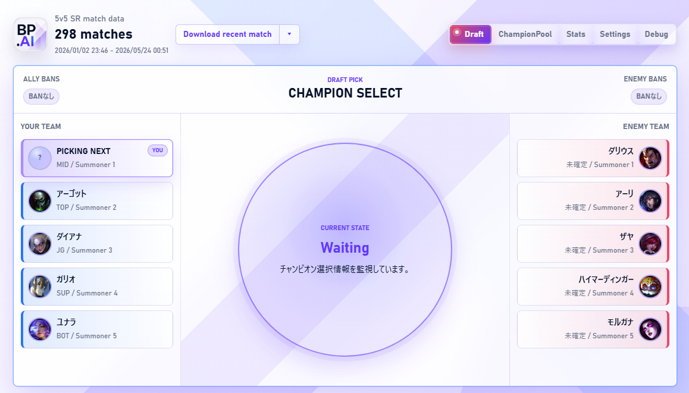
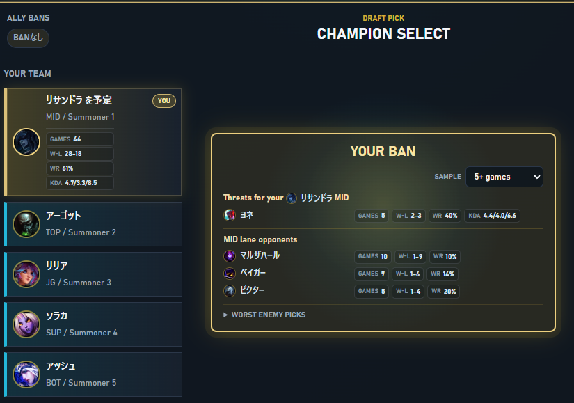
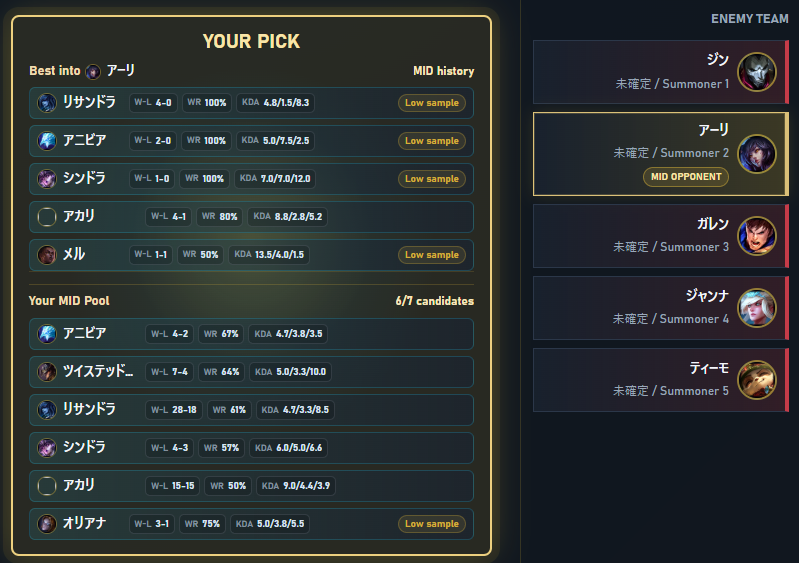

# LoL AI Draft Coach

LoL AI Draft Coach は、League of Legends のチャンピオン選択を見ながら、自分の得意チャンピオンや過去の戦績を確認できるローカルアプリです。

League of Legends クライアントから現在のロビー、チャンピオン選択、試合中かどうかといった状態を読み取り、バンピック中に役立つ情報を画面に表示します。将来的には AI による説明や提案も目指していますが、現在の主な機能はローカル情報と自分の戦績を使った補助表示です。



このアプリは情報表示と提案だけを行います。自動ピック、自動 BAN、自動ドッジ、ゲーム操作、メモリ読み取り、LoL クライアントの改ざんは行いません。

## できること

- LoL クライアントのログイン状態、ロビー、チャンピオン選択、試合中状態を表示します。
- チャンピオン選択中に、味方チーム、相手チーム、BAN、現在の操作待ち状態を確認できます。
- レーンごとに自分の ChampionPool を登録できます。
- BFF 経由で自分の直近試合や今シーズンの試合を取得し、チャンピオン別の勝敗、勝率、KDA を表示できます。
- 自分の BAN / PICK ターンでは、ChampionPool や過去戦績をもとにした候補や注意チャンピオンを表示します。
- 試合履歴はログイン中アカウントごとにローカル保存されます。

## 画面

### Draft

プレイヤー向けに、ドラフトに役立つ統計情報を提供します。

試合前のドラフトラウンドが始まると、BanPick.aiも自動でドラフト画面に移行します。

LoL にログインしていないときは未ログイン状態を表示します。


#### BAN ターン

自分の BAN ターンでは、現在の自分の予定チャンピオンやロールをもとに、苦手だった相手チャンピオンや同じレーンでよく負けている相手を確認できます。

試合数の条件を切り替えることで、少数サンプルを含めるかどうかも調整できます。



#### PICK ターン

既に相手チームに対面と思われるチャンピオンがPickされているなら、対面と思われるプレイヤーをクリックして、マークしましょう。

自分の PICK ターンでは、対面と思われるチャンピオンに対して相性のよかったチャンピオンと、登録済み ChampionPool の候補をまとめて確認できます。

各候補には自分の勝敗、勝率、KDA が表示されるため、慣れているチャンピオンと過去戦績の両方を見ながら選べます。

対面候補が2人いるなら、どちらにも対応できるチャンピオンが見つかるかもしれません。



### ChampionPool

レーンごとに、自分が使えるチャンピオンや得意なチャンピオンを登録する画面です。

`TOP / JG / MID / BOT / SUP` を切り替え、チャンピオン一覧から追加します。検索欄ではチャンピオン名や別名で絞り込めます。登録した内容は `保存` ボタンでローカルに保存されます。

Riot API から試合履歴を取得済みの場合、登録チャンピオンにはそのレーンで使ったときの試合数、勝敗、勝率、KDA も表示されます。

### Settings

アプリの接続設定を行う画面です。

- LoL インストールディレクトリを指定できます。
- ログイン先サーバを選択できます。

Riot API キーはクライアントでは扱いません。試合履歴は BFF 経由で取得します。

### Debug

接続状態や内部 state を確認するための画面です。通常利用では開く必要はありません。

## 使い方

1. League of Legends クライアントを起動してログインします。
2. このアプリを起動します。
3. 必要に応じて `Settings` で LoL インストールディレクトリを確認します。
4. `ChampionPool` で、レーンごとに使えるチャンピオンを登録して保存します。
5. 必要に応じて `Settings` でログイン先サーバを保存します。
6. ヘッダーの `Download recent match` で直近試合を取得します。右側のメニューから今シーズンの試合も取得できます。
7. チャンピオン選択に入ると、`Draft` 画面にバンピック状況と候補情報が表示されます。

## 試合履歴について

試合履歴と自己戦績は BFF 経由で Riot API Match-V5 から取得します。取得できる内容は、自分が使ったチャンピオン、勝敗、KDA、味方チャンピオン、相手チャンピオンなどです。

集計に使う試合は 5v5 Summoner's Rift の Ranked / Normal 系キューに絞っています。Ranked と Normal は分けて扱います。

Riot API の RateLimit にかかった場合は、指定された待機時間に従って再開します。待機中でも、すでに取得済みの試合があればその範囲で表示を更新します。

## 保存されるデータ

設定、ChampionPool、試合履歴キャッシュは PC 内に保存されます。Windows では通常、次の場所です。

```text
C:\Users\<ユーザー名>\AppData\Roaming\lol-ai-draft-coach\
```

主な保存内容:

```text
settings.json
champion-pool.json
riot-match-cache/<account-puuid>.json
match-history/<account-puuid>.json
```

同じ PC で複数アカウントを使う場合、ログイン中アカウントの試合データだけを読み込みます。

## 開発者向け情報

セットアップ、テスト、ログ、LCU API の手動確認、実装メモは [docs/development.md](docs/development.md) を参照してください。
